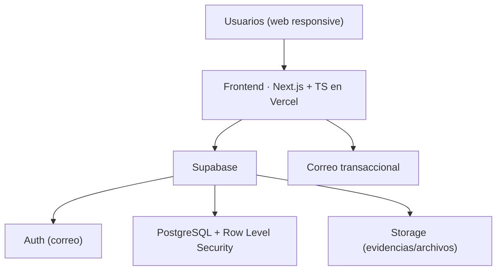

<div align="center">

# 🎓 CampusLab

**Plataforma de microproyectos reales y colaboración interdisciplinaria**

Convierte necesidades reales en microproyectos acotados y acompañados, para que estudiantes universitarios puedan colaborar, entregar resultados y construir un portafolio con evidencia desde una etapa temprana de su carrera, antes de realizar su primera práctica profesional o acceder a su primer empleo.


</div>

> [!IMPORTANT]
> **Propuesta independiente.** CampusLab **no** es una plataforma oficial ni cuenta todavía con patrocinio o aprobación institucional. Es un proyecto en fase de diseño, desarrollado como iniciativa estudiantil y vehículo de aprendizaje full-stack.

---

## 📑 Tabla de contenido

- [¿Qué es CampusLab?](#-qué-es-campuslab)
- [El problema](#-el-problema)
- [Cómo funciona](#-cómo-funciona)
- [Estado del proyecto](#-estado-del-proyecto)
- [Stack tecnológico](#-stack-tecnológico)
- [Alcance del MVP](#-alcance-del-mvp)
- [Arquitectura](#-arquitectura)
- [Estructura del repositorio](#-estructura-del-repositorio)
- [Puesta en marcha](#-puesta-en-marcha)
- [Roadmap](#-roadmap)
- [Documentación](#-documentación)
- [Contribución](#-contribución)
- [Licencia](#-licencia)

---

## 🧭 ¿Qué es CampusLab?

CampusLab es una plataforma web que conecta a **estudiantes** con **necesidades reales** publicadas por profesores, organizaciones sociales, unidades internas, centros de estudiantes, emprendimientos y pequeñas empresas. Cada necesidad se transforma en un **microproyecto**: breve, acotado y verificable, con roles definidos, entregable concreto, plazo limitado (2–8 semanas) y una persona responsable de acompañar el proceso.

Su espacio está **entre la formación académica y el trabajo formal**: no reemplaza una bolsa de empleo, un aula virtual ni la intranet institucional.

La idea es crear un puente simple entre quienes tienen una necesidad concreta y quienes necesitan una primera experiencia real para demostrar lo que saben hacer. Cada proyecto debe tener un alcance comprensible, un plazo acotado, roles claros, acompañamiento y un resultado que pueda revisarse y convertirse en evidencia de aprendizaje.

CampusLab busca que la experiencia no termine cuando se entrega un archivo: el proceso completo —postulación, equipo, hitos, retroalimentación y evaluación— queda organizado para que el estudiante pueda explicar qué hizo, cómo lo hizo y qué aprendió.

> **Tesis del proyecto:** el activo principal de CampusLab no es publicar oportunidades, sino **convertir necesidades reales en experiencias formativas verificables y repetibles**.

## 🎯 El problema

Muchos estudiantes aprenden herramientas y conceptos, pero llegan a la práctica profesional **sin experiencia demostrable** ni portafolio suficiente. Al mismo tiempo, muchas organizaciones tienen problemas pequeños que podrían ser experiencias formativas, pero **no cuentan con un canal simple** para estructurarlos y encontrar equipos estudiantiles.

## ⚙️ Cómo funciona

```
Patrocinador  ──▶  Moderación  ──▶  Publicación  ──▶  Postulaciones
   publica          (calidad)         (catálogo)        (estudiantes)
                                                             │
                                                             ▼
  Portafolio  ◀──  Evaluación  ◀──  Entrega  ◀──  Hitos  ◀──  Equipo
  (evidencia)                                                (formado)
```

Un patrocinador describe una necesidad mediante una **plantilla obligatoria**; un moderador verifica que sea apropiada y formativa; los estudiantes postulan a roles concretos; se forma un equipo y el proyecto avanza por hitos hasta la entrega, la evaluación y la generación de **evidencia para el portafolio**.

## 🚦 Estado del proyecto

> **Fase actual: construcción del MVP — el loop principal ya funciona.**

La **especificación de producto (PRD) está completa** y el proyecto avanza en código. Están el **scaffold** (Next.js + Supabase), el **modelo de datos completo** (14 migraciones · 17 tablas con Row Level Security), los **tipos TypeScript** generados desde el esquema y el **despliegue de migraciones por CI**. Sobre esa base ya está implementado el **circuito central del producto**:

- **Público** — catálogo de proyectos y ficha de detalle (SSR).
- **Autenticación** — registro con rol, ingreso y sesión.
- **Estudiante** — postular a un rol y seguir/retirar sus postulaciones.
- **Patrocinador** — crear organización, crear/editar/publicar proyectos con roles y habilidades, y **revisar postulaciones** (aceptar/rechazar).

Corre en local contra Supabase. Falta la **pasada de diseño** (alinear con Figma), la **moderación** de proyectos y el despliegue a producción.

| Fase | Descripción | Estado |
|------|-------------|--------|
| 0 · Descubrimiento | Entrevistas y validación del problema | 🟡 En progreso |
| 1 · Prototipo | Flujo completo en Figma, probado con usuarios | 🟡 En progreso |
| 2 · MVP | Flujo publicación → portafolio en producción | 🟡 En progreso (loop principal en código; falta portafolio, diseño y deploy) |
| 3 · Piloto | 10 proyectos, 30–50 estudiantes, 8 semanas | ⬜ Pendiente |
| 4 · Institucionalización | Presentar resultados y buscar continuidad | ⬜ Pendiente |

## 🛠️ Stack tecnológico

| Capa | Tecnología | Rol |
|------|-----------|-----|
| Frontend | **Next.js** (React) + **TypeScript** | Web responsive con SSR para el catálogo público |
| Backend administrado | **Supabase** | Autenticación, PostgreSQL, almacenamiento y políticas de acceso |
| Base de datos | **PostgreSQL** | Modelo relacional (proyectos, roles, postulaciones, equipos…) |
| Seguridad | **Row Level Security** | Permisos por rol y por propiedad del registro, en la base |
| Correo transaccional | **Brevo/AWS SES** | Confirmación de cuentas, recuperación de contraseña y notificaciones mediante correos personales |
| Despliegue | **Vercel** | Entrega continua + dominio propio (HTTPS) |
| CI/CD | **GitHub Actions** | Despliegue automático de migraciones al mergear a `main` |
| Diseño | **Figma** | Prototipos y pruebas antes de programar |

> Los tipos de TypeScript se **autogeneran desde el esquema de Supabase** (`supabase gen types`) para mantener sincronizados la base de datos y el código.

## 📦 Alcance del MVP

<table>
<tr><td>

**✅ Incluido**
- Registro y perfiles (estudiante / patrocinador)
- Creación de proyecto + moderación previa
- Catálogo con filtros
- Postulaciones y formación de equipos
- Hitos, entregas y evaluación
- Ficha de portafolio verificable
- Reportes y panel administrativo

</td><td>

**⛔ Fuera del MVP (por ahora)**
- Pagos / contratación laboral
- Matching con IA
- Chat en tiempo real propio
- SSO institucional y certificados oficiales
- App móvil nativa
- Marketplace sin moderación

</td></tr>
</table>

**Definición de Terminado:** el MVP está listo cuando un patrocinador puede publicar un proyecto aprobado, estudiantes postulan, se forma un equipo, se registran hitos, se entrega un resultado, el patrocinador evalúa y la plataforma genera una evidencia de portafolio.

## 🏗️ Arquitectura



## 📁 Estructura del repositorio

> `app/`, `components/`, `features/`, `lib/supabase/`, `types/` y `supabase/` están en uso. `tests/` (incluidas las pruebas de políticas RLS) se completa durante la Fase 2.

```
campuslab/
├── app/          # Páginas y rutas (Next.js App Router)
├── components/   # Interfaz reutilizable
├── features/     # Proyectos, postulaciones, equipos (lógica de dominio)
├── lib/          # Cliente de Supabase y utilidades
├── types/        # Modelos TypeScript (autogenerados + propios)
├── tests/        # Pruebas (incluye políticas RLS)
├── docs/         # Decisiones y documentación
└── supabase/     # Migraciones y políticas
```

## 🚀 Puesta en marcha

Requisitos: **Node 20+**, **npm** y (para Supabase local) **Docker**.

```bash
# 1. Instalar dependencias
npm install

# 2. Levantar Supabase local (requiere Docker) — imprime las claves locales
npx supabase start

# 3. Variables de entorno
cp .env.example .env.local
# Pegar en .env.local la API URL y la anon key que imprimió `supabase start`

# 4. Entorno de desarrollo
npm run dev        # http://localhost:3000
```

> `supabase start` aplica automáticamente las migraciones de `supabase/migrations/`. Para reconstruir la base desde cero o regenerar los tipos tras cambiar el esquema:
>
> ```bash
> npx supabase db reset                                                # recrea la base y reaplica todas las migraciones
> npx supabase gen types typescript --local > types/database.types.ts  # regenera los tipos TS
> ```

**Variables de entorno** (`.env.example`):

```env
NEXT_PUBLIC_SUPABASE_URL=
NEXT_PUBLIC_SUPABASE_ANON_KEY=
SUPABASE_SERVICE_ROLE_KEY=   # solo servidor, nunca en el cliente
```

> La app arranca aunque Supabase no esté configurado todavía: el `proxy.ts` se salta la sesión si faltan las claves.

## 🗺️ Roadmap

- [ ] **Fase 0** — Entrevistas (12 estudiantes, 5 patrocinadores) y validación del problema
- [ ] **Fase 1** — Prototipo del flujo completo en Figma u otro
- [ ] **Fase 2** — MVP: auth, perfiles, proyectos, moderación, postulaciones, equipos, hitos, evaluación y portafolio
- [ ] **Fase 3** — Piloto controlado (10 proyectos · 30–50 estudiantes · 8 semanas)
- [ ] **Fase 4** — Presentación de resultados y búsqueda de colaboración institucional

## 📚 Documentación

- **PRD (Product Requirements Document)** — documento maestro y fuente de verdad del producto (visión, requisitos, modelo de datos, arquitectura, piloto, riesgos y ADR). *Documento vivo, en Notion.*
- El informe conceptual completo (36 páginas) sirve como base del PRD.

## 🤝 Contribución

CampusLab es actualmente un proyecto de una sola persona, en construcción del MVP. La construcción del MVP puede hacerse en solitario; **el piloto no**: requiere sumar mentores, patrocinadores y un enlace institucional. Si te interesa colaborar (mentoría, proyectos semilla o desarrollo), abre un *issue* para conversarlo.

## 📄 Licencia

Por definir. Hasta entonces, todos los derechos reservados por el autor. Cualquier uso del código o del contenido requiere autorización previa.

---

<div align="center">
<sub>Desarrollado por <a href="https://github.com/wDEVil5">W_ILNE_S</a> · Ingeniería en Computación e Informática, UNAB · 2026</sub>
</div>
