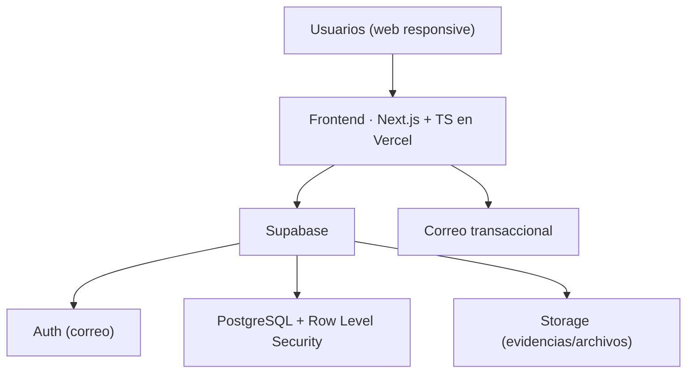

<div align="center">

# 🎓 CampusLab

**Plataforma de microproyectos reales y colaboración interdisciplinaria**

Convierte necesidades reales en experiencias formativas verificables para estudiantes universitarios.

-orange)


</div>

> [!IMPORTANT]
> **Propuesta independiente.** CampusLab **no** es una plataforma oficial de la Universidad Andrés Bello (UNAB) ni cuenta todavía con patrocinio o aprobación institucional. Es un proyecto en fase de diseño, desarrollado como iniciativa estudiantil y vehículo de aprendizaje full-stack.

---

## 📑 Tabla de contenido

- [¿Qué es CampusLab?](#-qué-es-campuslab)
- [El problema](#-el-problema)
- [Cómo funciona](#-cómo-funciona)
- [Estado del proyecto](#-estado-del-proyecto)
- [Stack tecnológico](#-stack-tecnológico)
- [Alcance del MVP](#-alcance-del-mvp)
- [Arquitectura](#-arquitectura)
- [Estructura del repositorio](#-estructura-del-repositorio)
- [Puesta en marcha](#-puesta-en-marcha)
- [Roadmap](#-roadmap)
- [Documentación](#-documentación)
- [Contribución](#-contribución)
- [Licencia](#-licencia)

---

## 🧭 ¿Qué es CampusLab?

CampusLab es una plataforma web que conecta a **estudiantes** con **necesidades reales** publicadas por profesores, organizaciones sociales, unidades internas, centros de estudiantes, emprendimientos y pequeñas empresas. Cada necesidad se transforma en un **microproyecto**: breve, acotado y verificable, con roles definidos, entregable concreto, plazo limitado (2–8 semanas) y una persona responsable de acompañar el proceso.

Su espacio está **entre la formación académica y el trabajo formal**: no reemplaza una bolsa de empleo, un aula virtual ni la intranet institucional.

> **Tesis del proyecto:** el activo principal de CampusLab no es publicar oportunidades, sino **convertir necesidades reales en experiencias formativas verificables y repetibles**.

## 🎯 El problema

Muchos estudiantes aprenden herramientas y conceptos, pero llegan a la práctica profesional **sin experiencia demostrable** ni portafolio suficiente. Al mismo tiempo, muchas organizaciones tienen problemas pequeños que podrían ser experiencias formativas, pero **no cuentan con un canal simple** para estructurarlos y encontrar equipos estudiantiles.

## ⚙️ Cómo funciona

```
Patrocinador  ──▶  Moderación  ──▶  Publicación  ──▶  Postulaciones
   publica          (calidad)         (catálogo)        (estudiantes)
                                                             │
                                                             ▼
  Portafolio  ◀──  Evaluación  ◀──  Entrega  ◀──  Hitos  ◀──  Equipo
  (evidencia)                                                (formado)
```

Un patrocinador describe una necesidad mediante una **plantilla obligatoria**; un moderador verifica que sea apropiada y formativa; los estudiantes postulan a roles concretos; se forma un equipo y el proyecto avanza por hitos hasta la entrega, la evaluación y la generación de **evidencia para el portafolio**.

## 🚦 Estado del proyecto

> **Fase actual: diseño / pre-MVP.**

Este repositorio está en su punto de partida: la **especificación de producto (PRD) está completa** y las decisiones técnicas están tomadas, pero el desarrollo del código **aún no comienza**. El objetivo inmediato es validar el problema (entrevistas + prototipo) antes de construir el MVP.

| Fase | Descripción | Estado |
|------|-------------|--------|
| 0 · Descubrimiento | Entrevistas y validación del problema | ⬜ Pendiente |
| 1 · Prototipo | Flujo completo en Figma, probado con usuarios | ⬜ Pendiente |
| 2 · MVP | Flujo publicación → portafolio en producción | ⬜ Pendiente |
| 3 · Piloto | 10 proyectos, 30–50 estudiantes, 8 semanas | ⬜ Pendiente |
| 4 · Institucionalización | Presentar resultados y buscar continuidad | ⬜ Pendiente |

## 🛠️ Stack tecnológico

| Capa | Tecnología | Rol |
|------|-----------|-----|
| Frontend | **Next.js** (React) + **TypeScript** | Web responsive con SSR para el catálogo público |
| Backend administrado | **Supabase** | Autenticación, PostgreSQL, almacenamiento y políticas de acceso |
| Base de datos | **PostgreSQL** | Modelo relacional (proyectos, roles, postulaciones, equipos…) |
| Seguridad | **Row Level Security** | Permisos por rol y por propiedad del registro, en la base |
| Despliegue | **Vercel** | Entrega continua + dominio propio (HTTPS) |
| Diseño | **Figma u otro** | Prototipos y pruebas antes de programar |

> Los tipos de TypeScript se **autogeneran desde el esquema de Supabase** (`supabase gen types`) para mantener sincronizados la base de datos y el código.

## 📦 Alcance del MVP

<table>
<tr><td>

**✅ Incluido**
- Registro y perfiles (estudiante / patrocinador)
- Creación de proyecto + moderación previa
- Catálogo con filtros
- Postulaciones y formación de equipos
- Hitos, entregas y evaluación
- Ficha de portafolio verificable
- Reportes y panel administrativo

</td><td>

**⛔ Fuera del MVP (por ahora)**
- Pagos / contratación laboral
- Matching con IA
- Chat en tiempo real propio
- SSO UNAB y certificados oficiales
- App móvil nativa
- Marketplace sin moderación

</td></tr>
</table>

**Definición de Terminado:** el MVP está listo cuando un patrocinador puede publicar un proyecto aprobado, estudiantes postulan, se forma un equipo, se registran hitos, se entrega un resultado, el patrocinador evalúa y la plataforma genera una evidencia de portafolio.

## 🏗️ Arquitectura



## 📁 Estructura del repositorio

> Estructura orientativa objetivo (se irá creando durante la Fase 2).

```
campuslab/
├── app/          # Páginas y rutas (Next.js App Router)
├── components/   # Interfaz reutilizable
├── features/     # Proyectos, postulaciones, equipos (lógica de dominio)
├── lib/          # Cliente de Supabase y utilidades
├── types/        # Modelos TypeScript (autogenerados + propios)
├── tests/        # Pruebas (incluye políticas RLS)
├── docs/         # Decisiones y documentación
└── supabase/     # Migraciones y políticas
```

## 🚀 Puesta en marcha

> ⚠️ Aún no hay código ejecutable. Estos pasos quedan documentados para cuando comience la Fase 2 (MVP).

```bash
# 1. Clonar el repositorio
git clone https://github.com/wDEVil5/CampusLab.git
cd CampusLab

# 2. Instalar dependencias
npm install

# 3. Configurar variables de entorno
cp .env.example .env.local
# Completar con las credenciales de tu proyecto de Supabase

# 4. Levantar el entorno de desarrollo
npm run dev
```

**Variables de entorno necesarias** (referencia):

```env
NEXT_PUBLIC_SUPABASE_URL=
NEXT_PUBLIC_SUPABASE_ANON_KEY=
SUPABASE_SERVICE_ROLE_KEY=   # solo servidor, nunca en el cliente
```

## 🗺️ Roadmap

- [ ] **Fase 0** — Entrevistas (12 estudiantes, 5 patrocinadores) y validación del problema
- [ ] **Fase 1** — Prototipo del flujo completo en Figma u otro
- [ ] **Fase 2** — MVP: auth, perfiles, proyectos, moderación, postulaciones, equipos, hitos, evaluación y portafolio
- [ ] **Fase 3** — Piloto controlado (10 proyectos · 30–50 estudiantes · 8 semanas)
- [ ] **Fase 4** — Presentación de resultados y colaboración con UNAB

## 📚 Documentación

- **PRD (Product Requirements Document)** — documento maestro y fuente de verdad del producto (visión, requisitos, modelo de datos, arquitectura, piloto, riesgos y ADR). *Documento vivo, en Notion.*
- El informe conceptual completo (36 páginas) sirve como base del PRD.

## 🤝 Contribución

CampusLab es actualmente un proyecto de una sola persona en fase de diseño. La construcción del MVP puede hacerse en solitario; **el piloto no**: requiere sumar mentores, patrocinadores y un enlace institucional. Si te interesa colaborar (mentoría, proyectos semilla o desarrollo), abre un *issue* para conversarlo.

## 📄 Licencia

Por definir. Hasta entonces, todos los derechos reservados por el autor. Cualquier uso del código o del contenido requiere autorización previa.

---

<div align="center">
<sub>Desarrollado por <a href="https://github.com/wDEVil5">W_ILNE_S</a> · Ingeniería en Computación e Informática, UNAB · 2026</sub>
</div>
